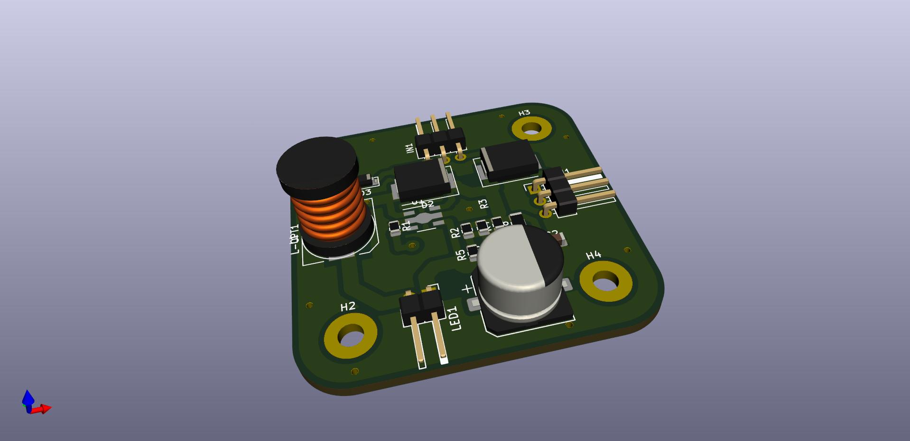

# pt4115_cnc_laser_driver

This is simple PT4115 IC diode driver for CNC Laser.

My laser is Nichia 1.8W module. The current is set for 0.9A

The PCB has been engraved using V-bit on the same 3018 CNC machine

